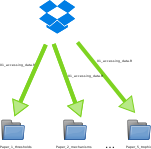
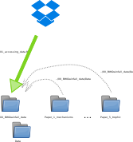
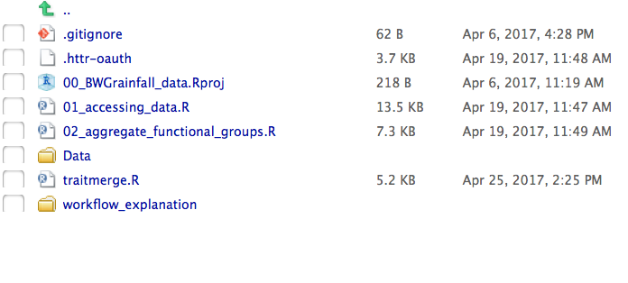
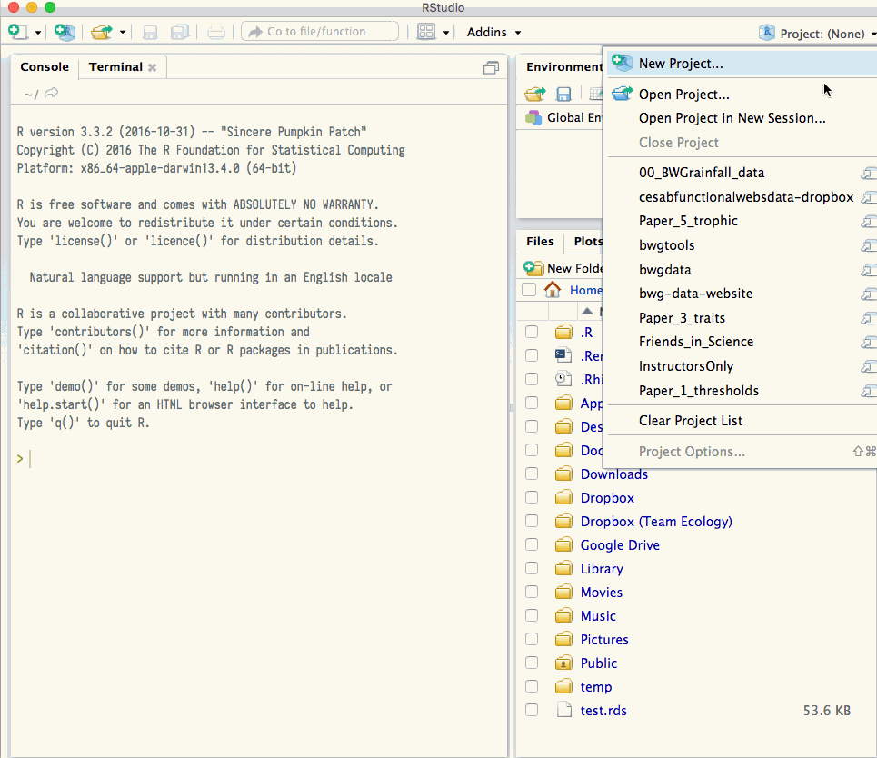
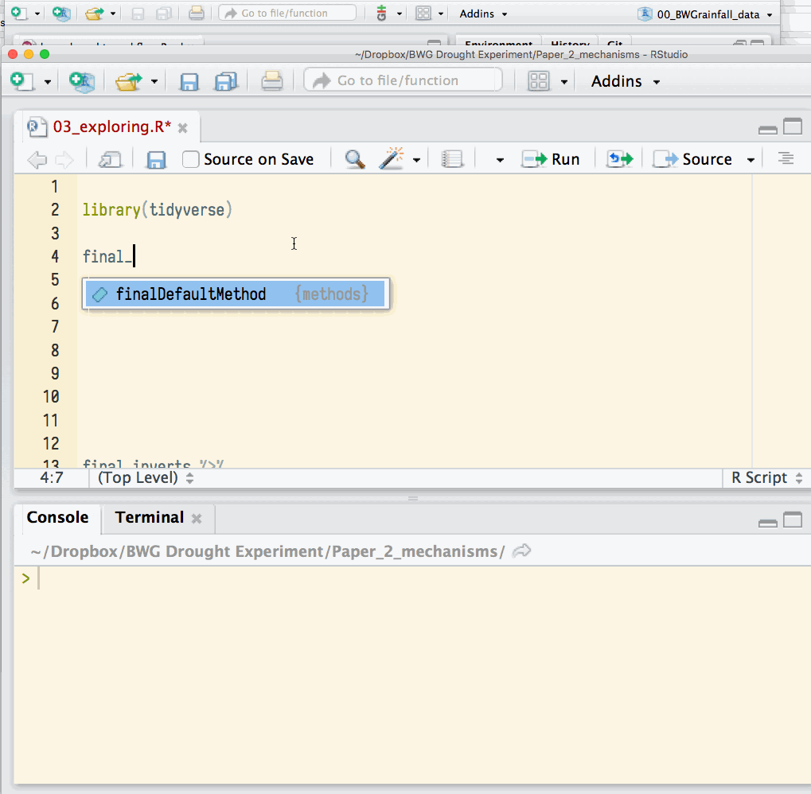

I would like to suggest a small change to our workflow for organizing the BWG Drought Experiment analyses. As you know, we have a shared Dropbox folder, which contains one folder for each paper. Formerly, each paper was supposed to contain one whole version of the dataset, containing variables appropriate for that paper. My suggestion is to keep a "Master copy" of the downloaded, edited data in a dedicated folder, `00_BWGrainfall_data`. Data will be downloaded and written to this folder by a single "master" script, then each paper can read from it. This has the advantage of concentrating a lot of detail in only one place. More details below:

## The Old Way of doing things

Our original plan for organizing this data was to create R scripts in each directory. This R script would be called `01_accessing_data.R` in all datasets. Our original plan was that each `01_accessing_data.R` script would create just the data that each paper required. The workflow could be visualized like this:

```{r, out.width="400px", out.height="400px", dev='svg'}

```

The green arrows show the data being downloaded from our shared dropbox, merged with the latest trait information from the database, modified, calculated etc, and saved into the `Data/` subfolder in each `Paper` folder. 

However, this process (which I think we originally thought would be straightforward) has become more complex! For example, the master data file for Diane's flagship `Paper_1_thresholds` does the following steps:

* downloads all data
* corrects a few spelling mistakes
* downloads latest taxonomy and latest traits
* merges these
* calculates biomasses of functional groups and taxonomy
* identifies leaky leaves (which bias calculations of hydrology)
* calculates hydrology
* summarizes ibuttons

Because Diane's paper takes a broad, holistic view of the data, most other papers will require a subset of these data (perhaps with other information, such as more traits or the terrestrial taxa). However, the process has become so involved that I suggest it is a risk to do it more than once! If we find an error, or want to make a change or correction, everyone will have to edit their `01_accessing_data.R` scripts, multiplying the chances of error

## the New Way

I propose we follow a workflow that looks something like this: 

```{r, out.width="400px", out.height="400px", dev='svg'}

```

In this model, all the downloading and cleaning of the data is done in one folder. This folder is called `00_BWGrainfall_data` and it's organization is very simple: just a few R scripts to access the data, and two folders: One for the `Data`, and another to hold this `docs`:

```{r}

```

### Accessing data using relative paths

What is the best way to access these data from another folder? One solution might be to copy it -- however this is _risky_: if the data should change (e.g. if we find and correct an error), then your copied data would be out of date. An easier solution is to use _relative paths_. We can use this shortcut because we all have the exact same configuration of files on our computers, thanks to the Magic of Dropbox! 
A relative path points to where a file is on a computer _relative_ to the current working directory. In Rstudio, the working directory is set automatically when you open an "Rstudio Project". Opening a project is a short three-step process:

1. Open Rstudio
2. go to `File > Open Project..` and find the Paper you want in your dropbox.
3. Click the Rstudio project file (e.g. `Paper_2_mechanisms.Rproj`).



Now that you have a project open, your working directory is set to this project directory. That means we can use a relative path from this directory to the data. We will read the data into R, and continue working in the project directory. 

For example, if you have opened (for example) the `Paper_2_mechanisms`, you can read in the data with the following relative path:

```r
final_inverts <- read.csv("../00_BWGrainfall_data/Data/BWG_final_invertebrates.csv")
```

the two dots (`..`) means "the folder above". So we go from the `Paper_2_mechanisms` folder up into the `BWG Drought Experiment` folder, then back down into the `00_BWGrainfall_data` folder. Here is an example (you can also see this file in your own dropbox! under `BWG Drought Experiment/Paper_2_mechanisms/Rscripts/03_exploring.R`)



## I found an error / need to make a new variable !

In this workflow, how do we make changes? What changes ought to be made where? I suggest that this depends on how many papers are likely to be affected by this change.

#### You discover that data was typed in incorrectly

Hopefully this is very unlikely! This is the only case that should lead to directly editing the Dropbox raw data folders.

#### You discover new species-level traits 

This might be a new functional trait, or better taxonomy, or both. We had a recent example when a Tabanid from Argentina was re-identified as a different, non-predatory animal. In this case, we only need to change the [species database](http://www.zoology.ubc.ca/~lui/v1/#/dashboard) or the new Trait table. If you need to make a change like this, please contact Diane, Regis or Andrew to let us know! I think that most users of the data have the ability to edit these values directly, but it would still be good to know such changes were happening!

#### You would like to calculate a new, multi-purpose variable

By "multi-purpose" I mean a variable that will be used on multiple papers. In this case, it makes sense to include this in `00_BWGrainfall_data` for all of us to use. For example, Diane has calculated the abundance and biomass of every functional and taxonomic category, and these are included in one of the master data files in that folder. 

Anyone can make edits to the R scripts in `00_BWGrainfall_data`, and it should be in everyone's dropbox now. Again, an email to the group (or just Nicolas, Diane or Andrew) would be appreciated so we know that changes are being made!

If your calculation is relevent to your paper alone, then it is probably best to do it in an R script within your own paper folder. If we discover later that other people want those numbers, we can easily the calculation to `00_BWGrainfall_data`. 

## What data do we have

As of this writing (May 2017), we have the following files in `00_BWGrainfall_data`:

* `BWG_bromeliad_variables.csv`
* `BWG_final_invertebrate_traits.csv`    
* `BWG_final_invertebrates.csv` -- one row for every insect x bromeliad combination (long format)
* `BWG_site_info.csv`                      
* `BWG_wide_functional_groups_ibuttons.csv` -- one row for every bromeliad. This dataset is _very_ wide, containing all the functional-group level summaries for Paper 1 and Paper 5, and also the ibutton (temperature) summaries.
* `BWGrainfall_long_ibuttons.csv`

## Get in touch if you have thoughts!

Please get in touch if you have any questions or comments. It is my hope that by organizing our workflow in this way, we can make our work more reproducible and more correct for everyone. I hope that we can arrive at a workflow that is comfortable and efficient for everyone. Looking forward to hearing what you think!

